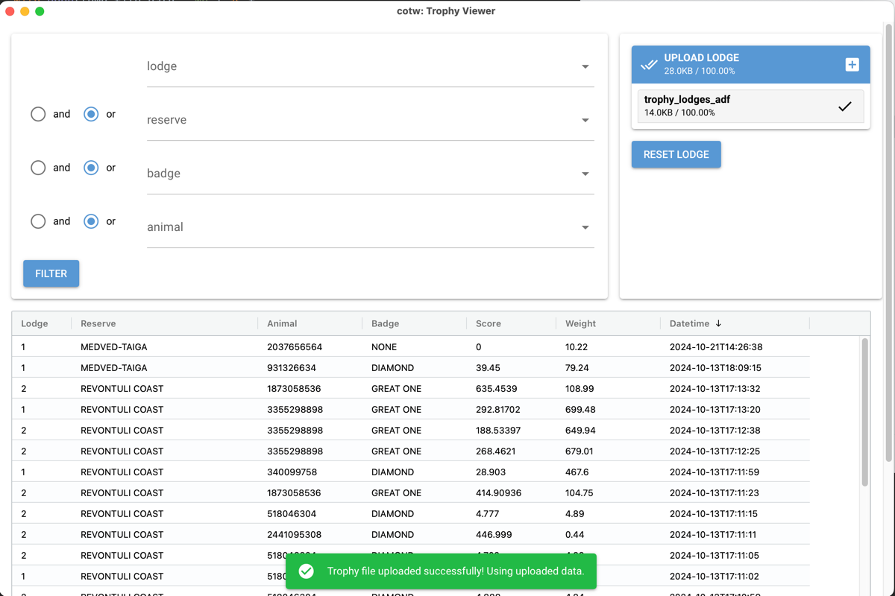

# COTW trophy viewer



### Installation

Download release and run the `.exe` locally 

### Run/build locally

```
git clone https://gitea.com/tp21/cotw-trophy-viewer.git &&
cd cotw-trophy-viewer &&
sh/setup.sh 
```
then `sh/run.sh` or `sh/runNative.sh` or `sh/build.sh` etc

### Animal type name mapping

Animal type name in the parsed adf file is hashed at the moment and am looking that up, another way could be to not hash it in the first place, but I'm not confident with files in the `deca` package, which will probably be the downfall of this project :)

### Notes

Lots copied from these, thank you!

- [cotw-harvest-tracker](https://github.com/LordHansCapon/cotw-harvest-tracker)
- [animal-population-changer](https://github.com/cpypasta/apc)